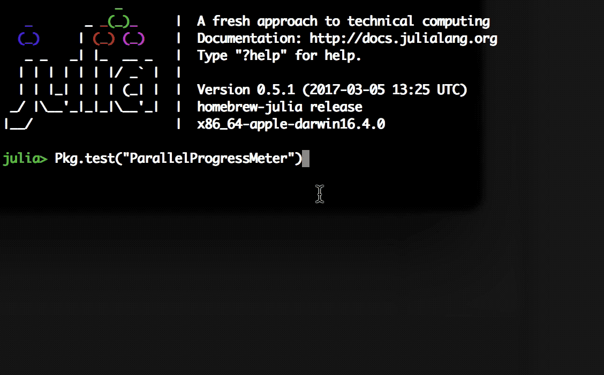

# ParallelProgressMeter

[](https://travis-ci.org/jekyllstein/ParallelProgressMeter.jl) [](https://coveralls.io/github/jekyllstein/ParallelProgressMeter.jl) [](http://codecov.io/github/jekyllstein/ParallelProgressMeter.jl)

Parallel progress meter for long running serial tasks being executed in a parallel for loop in Julia

## Installation

Within julia, execute

```julia
Pkg.clone("https://github.com/jekyllstein/ParallelProgressMeter.jl")
```

## Usage

### Progress for N serial tasks with a pre-determined number of steps for each task

The following functions are used for @parallel for loops that execute some function serialTask() in parallel.  
A progress percentage and ETA will be shown for each parallel task running as seen in the gif below:



The script below demonstartes initializing the package, adding workers to julia, defining a 
serial task function, and executing it in parallel with the active progress monitor:

```julia
using ParallelProgressMeter

#add one worker for each parallel task.  The test suite will include
#cases where the number of tasks exceeds the available workers.
numTasks = 4
addprocs(numTasks)

#Note that the function is defined below with an @everything macro tag after 
#the additional workers were added, ensuring it is available on all workers.

#number of times each task will iterate, in this case every task 
#will perform 1e8 iterations
params = round(Int, 1e8)*ones(Int64, numTasks)

#define a generic serial task that will be run in parallel once for each CPU core
#in order to push updates to the progressArray each serial task must have access to
#the shared array keeping track of progress and take the task number as input
@everywhere function serialTask1(N::Int64, taskNum::Int64, p::SharedArray{Int64, 1})
    a = 0.0
    for i = 1:N
        a += rand()
        p[taskNum] += 1
    end
    return a
end

#initialize parallel progress monitor and save shared array
p = initializeProgress(numTasks, params)

#run parallel for loop with progress meter
@parallel (vcat) for i = 1:numTasks
    serialTask1(params[i], i, p)
end
```

### Progress for 1 parallel tasks with a pre-determined number of steps across multiple workers

The following functions are used for a single @parallel for loop with an inner code block that can be
run in parallel.  A single progress percentage and ETA will be shown for the task.

The script below demonstrates adding workers to julia, initializing the package on multiple workers, initializing
the monitor and inserting the next! iterator into the loop body:

```julia
addprocs(3)
@everywhere using ParallelProgressMeter

##-----------------------------------Parameters for single task test--------------------------------------
N = Int64(5e8)
#---------------------------------------------------------------------------------------------------------

p = initializeProgress(N)

#the value being accumulated must be at the end of the loop code block but the next! line should 
#appear after the desired computation
a = @parallel (+) for i = 1:N
    tmp = rand()
    next!(p)
    tmp
end
```

## Notes
### Multiple serial tasks
The initialization function is the only exported part of the package and returns a shared array which must be passed into
the loop function.  In cases where numTasks exceeds or equals the available workers, you will notice one progress bar remaining
at 00.00% until all other tasks are complete as expected by not having enough workers to launch every task in parallel.

The serialTask function requires two inputs to work with the progress meter as well as a line of code inside the loop that triggers
whith each iteration.  The two inputs are the task number which identifies this task in the parallel loop as well as the initialized
shared array.  The line inside the loop simply increments the shared array by 1 in the element corresponding to the task number.  
### Single parallel task
Similar to the other initialization function, the single task version returns a shared array.  It also returns a dictionary mapping
the worker id's to the indicies of the progressArray to be updated.  This pair as a tuple is passed to the next! function which can be 
inserted into the parallel for loop body to push updates to the monitor.  For a single task, the initialization and next! code lines mimic
the streamlined approach in timholy/ProgressMeter.jl but requires the package to be initialized on all added workers with the @everything macro.


## Future Plans
Requiring serialTask to take two inputs and insert a line of code in the inner loop is cluncky.  Alternatively a macro could be defined that automatically initializes the monitor and runs a code block that contains a loop wrapping it in an outer parallel loop.  The macro could insert the update code inside the 
inner loop with the correct task number.  The parallel loop construction should be linked to the initialization because the program
only makes sense if the numTasks is used for both.

In testing a significant performance hit is observed compared to code without an active monitor.  Future updates should consider alternative methods that
see faster execution times.  It is possible that the shared array is the primary cause of the slowdown.  Some method of blocking in which the worker updates
are not pushed each iteration but only after the delay time would likely help but make the code far more complex.

## Credits
Structure inspired by the package https://github.com/timholy/ProgressMeter.jl.  Basic parallel functionality created by Jason Eckstein @jekyllstein and Michael Jin @mikhail-j
